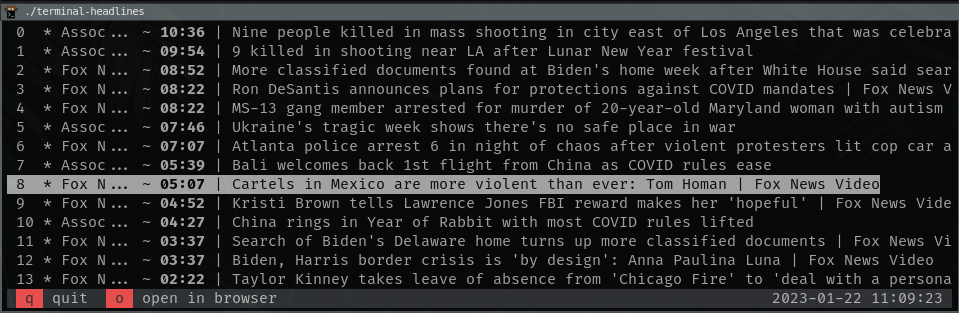

# terminal-headlines

You can stay on top of the news headlines from your favorite sources with **terminal-headlines**, keep updated on the latest headlines straight from the comfort of your command line.



## Features

* Designed to be lightweight and fast (*at least that's the idea*)
* Customize your news sources to only see what you care about
* Display a more detailed description of the selected article
* Open articles in browser
* Automatic updates for news every X minutes
* Cross-platform compatibility (Windows, Linux, MacOS)
* Open Source

##  Installation
#### Create config

Create **/data/config.json**, replace with your API key from [NewsAPI.org](https://newsapi.org/) and choose the [sources](https://newsapi.org/sources). 

```
{
    "api_key": "xxxxxxxxxxxxxxxxxxxxxxxxxxxxx",
    "sources": "associated-press,fox-news"
}
```
###### Note: API is not open source, however as the project is under development and until a solution is found, newsAPI offers a development plan that can be used for development / testing purposes.

#### Compile

```
g++ main.cpp -lcurl -lncurses -o terminal-headlines
```
#### Run

```
./terminal-headlines
```
